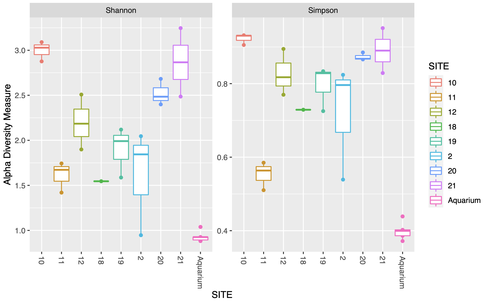

##  {background-color="black" background-image="./figures/NEOF_blue_bg_180_degrees.png"}

[Curious Archives]{.title-slide-text}

or: Books that question you

{width="40%"}

## Intro

::::: columns
::: {.column width="60%"}
-   Matthew Gemmell (he/him)
-   Microbiology background
-   CGR (UoL) & NEOF
-   ELIXIR-UK Training club committee
-   Bioinformatics trainer
    -   Since 2015
    -   10-15 workshop p/a
    -   \> 70 workshops
:::

::: {.column width="40%"}

{style="max-width:40%; border-radius: 10px; border: 5px solid #0082c8"}

{style="max-width:100%; border-radius: 10px; border: 5px solid #0082c8"}

{style="max-width:100%; border-radius: 10px; border: 5px solid #0082c8; background-color: white"}

:::
:::::

## Contents

::::: columns
::: {.column width="60%"}
-   Formative assessment

-   MCQs

    -   Good practices
    
    -   Benefits

    -   Different uses
    
-   Based on my [PGCAP findings](https://m-gemmell.github.io/PGCAP/portfolio/06-Patch_3a.html)
:::

::: {.column width="40%"}

{width="100%"}

:::
:::::

##  {background-color="black" background-image="./figures/NEOF_blue_bg_180_degrees.png"}

::: {.absolute top="100" width="100%"}

[Formative Assessment]{.title-slide-text}

{width="40%"}

:::

## Formative assessment

::::: columns
::: {.column width="60%"}
-   Continuous checks and balances during learning
-   Teacher checks:
    -   Learner's progress
    -   Effectiveness of teaching practice
-   Self assessment of learners
-   Very different to Summative assessment (e.g. exams)
:::

::: {.column width="40%"}

{width="100%"}

:::
:::::

## Benefits

::::: columns
::: {.column width="75%"}
-   Beneficial and enjoyable for students (Adkins, 2018)
-   Help students monitor their progress and encourage further study (McCallum & Milner, 2021)
-   Incorporate aspects of a flipped classroom
    -   Self paced
    -   Decrease cognitive load
    -   Support a diverse group of students in their learning
    -   (Cortese et al., 2022)
:::

::: {.column width="25%"}

{width="100%"}

:::
:::::

## Variety

::::: columns
::: {.column width="70%"}
-   Formative assessment gives variety
-   Pause reading, start applying
-   Exercises
    -   Include an answer chapter
-   Verbally ask learners their progress and understanding
-   MCQs (Multiple Choice Questions)
:::

::: {.column width="30%"}

{width="100%"}

:::
:::::

##  {background-color="black" background-image="./figures/NEOF_blue_bg_180_degrees.png"}

::: {.absolute top="100" width="100%"}

[MCQs]{.title-slide-text}

{width="40%"}

:::

## MCQs

::::: columns
::: {.column width="60%"}
-   Multiple Choice Question
-   Webexercises R package
-   Bookdown/Quarto
-   Examples
    -   Quiz Extension For Quarto
    -   Works with revealjs
    -   Github parmsam/quarto-quiz
:::

::: {.column width="40%"}

{width="100%"}

:::
:::::

## Example MCQ {.quiz-question}

-   I'm incorrect
-   I'm also incorrect
-   [I'm correct]{.correct}

## MCQ design

::::: columns
::: {.column width="70%"}
-   Three choices
    -   Optimal amount (Rodriguez, 2005)
-   Macro design strategies
    -   Interspersed answers
    -   (Söbke & Mosebach, 2020)
-   Sets of 3 questions with the same three choices
:::

::: {.column width="30%"}

{width="100%"}

:::
:::::

## Number of metres in a mile {.quiz-question}

-   1000
-   [1609]{.correct}
-   1825

## Number of metres in a kilometre {.quiz-question}

-   [1000]{.correct}
-   1609
-   1825

## Number of metres in a nautical mile {.quiz-question}

-   1000
-   1609
-   [1825]{.correct}

## MCQ benefits

::::: columns
::: {.column width="70%"}
-   Practically feasible
-   Intuitive for learners
-   Instant feedback
    -   (Snekalatha et al., 2021).
-   Reattempting questions is allowed and is beneficial to learning
    -   (Zhang et al., 2021).
:::

::: {.column width="30%"}

{width="100%"}

:::
:::::

- Guide learners helping their progress (Kojo et al., 2018)

## MCQ uses

::::: columns
::: {.column width="70%"}
-   Reinforcing definitions & theory
-   Recap questions at end of sections
    - Promote recall (Yang, 2019)
-   Interrogate output
    - Vital skill to learn in data science (Via, 2022)
:::

::: {.column width="30%"}

{width="100%"}

:::
:::::

## What is an MCQ? {.quiz-question}

- Recall
- During learning
- [Multiple choice question]{.correct}

## When is formative assessment carried out? {.quiz-question}

- Recall
- [During learning]{.correct}
- Multiple choice question

##  What do recap MCQs promote? {.quiz-question}

- [Recall]{.correct}
- During learning
- Multiple choice question

## Interrogate output

::::: columns
::: {.column width="70%"}
-   MCQs to help guide interpretation
-   Students know what to look at
-   MCQs inform them if they are looking in wrong/right location
-   We'll look at some alpha diversity box plots
    - 16S bacterial community
    - Measure of diversity
    - Alpha i.e. value calculated for each sample
:::

::: {.column width="30%"}

{width="100%"}

:::
:::::

## Which site has the lowest diversity? {.quiz-question}

::::: columns

::: {.column width="80%"}

{width="100%"}

:::

::: {.column width="20%"}
- [Aquarium]{.correct}
- Site 2
- Site 10
:::
:::::

## Which site, of the options provided, has the highest diversity? {.quiz-question}

::::: columns

::: {.column width="80%"}

{width="100%"}

:::

::: {.column width="20%"}
- Aquarium
- Site 2
- [Site 10]{.correct}
:::
:::::

## Which site has the greatest range of Shannon values? {.quiz-question}

::::: columns

::: {.column width="80%"}

{width="100%"}

:::

::: {.column width="20%"}
- Aquarium
- [Site 2]{.correct}
- Site 10
:::
:::::

## How many sites have a median Shannon value greater than 2.0? {.quiz-question}

::::: columns

::: {.column width="80%"}

{width="100%"}

:::

::: {.column width="20%"}
- 2
- 3
- [4]{.correct}
:::
:::::

## How many sites have a median Simpson value less than 0.6? {.quiz-question}

::::: columns

::: {.column width="80%"}

{width="100%"}

:::

::: {.column width="20%"}
- [2]{.correct}
- 3
- 4
:::
:::::

## Outro

::::: columns
::: {.column width="60%"}
-   Formative assessment & MCQs

-   Design practices
    - 3 questions with the same 3 choices
    
-   MCQs uses
    - Definitions and theory
    - Recap questions
    - Interrogate output

- Thanks for listening

- Questions?
:::

::: {.column width="40%"}

{width="100%"}

:::
:::::

## Citations {.scrollable}

+--------------------------------------------------------------------------------------------------------------------------------------------------------------------------------------------------------------------------------------------------------------------------------------------+
| 1.  Adkins, J. K. (2018). Active learning and formative assessment in a user-centered design course. Information Systems Education Journal, 16(4), 34.                                                                                                                                     |
|                                                                                                                                                                                                                                                                                            |
| 2.  Cortese, G., Greif, R., & Mora, P. C. (2022). Flipped classroom and a new hybrid “Teach the Airway Teacher” course: an innovative development in airway teaching?. Trends in Anaesthesia & Critical Care, 42, 1.                                                                       |
|                                                                                                                                                                                                                                                                                            |
| 3.  Foley, D. (2020). Teachable Teachers: Using Circumspect Feedback to Improve Teaching and Learning.                                                                                                                                                                                     |
|                                                                                                                                                                                                                                                                                            |
| 4.  Kojo, A., Laine, A., & Näveri, L. (2018). How did you solve it?– Teachers’ approaches to guiding mathematics problem solving. LUMAT: International Journal on Math, Science and Technology Education, 6(1), 22-40.                                                                     |
|                                                                                                                                                                                                                                                                                            |
| 5.  McCallum, S., & Milner, M. M. (2021). The effectiveness of formative assessment: student views and staff reflections. Assessment & Evaluation in Higher Education, 46(1), 1-16.                                                                                                        |
|                                                                                                                                                                                                                                                                                            |
| 6.  McClatchy, S., Bass, K. M., Gatti, D. M., Moylan, A., & Churchill, G. (2020). Nine quick tips for efficient bioinformatics curriculum development and training. PLoS Computational Biology, 16(7), e1008007.                                                                           |
|                                                                                                                                                                                                                                                                                            |
| 7.  Rodriguez, M. C. (2005). Three options are optimal for multiple‐choice items: A meta‐analysis of 80 years of research. Educational measurement: issues and practice, 24(2), 3-13.                                                                                                      |
|                                                                                                                                                                                                                                                                                            |
| 8.  Snekalatha, S., Marzuk, S. M., Meshram, S. A., Maheswari, K. U., Sugapriya, G., & Sivasharan, K. (2021). Medical students’ perception of the reliability, usefulness and feasibility of unproctored online formative assessment tests. Advances in physiology education, 45(1), 84-88. |
|                                                                                                                                                                                                                                                                                            |
| 9.  Söbke, H., & Mosebach, J. (2020, October). Macro Design of Multiple-Choice Questions for Learning. In European Conference on e-Learning (pp. 476-XX). Academic Conferences International Limited.                                                                                      |
|                                                                                                                                                                                                                                                                                            |
| 10. Via, A., Palagi, P. M., Lindvall, J. M., & Attwood, T. K. (2022). Introducing the The Mastery Rubric for Bioinformatics–a Professional Guide. F1000Research, 11(735), 735.                                                                                                             |
|                                                                                                                                                                                                                                                                                            |
| 11. Yang, B. W., Razo, J., & Persky, A. M. (2019). Using testing as a learning tool. American journal of pharmaceutical education, 83(9).                                                                                                                                                  |
|                                                                                                                                                                                                                                                                                            |
| 12. Zhang, S., Bergner, Y., DiTrapani, J., & Jeon, M. (2021). Modeling the interaction between resilience and ability in assessments with allowances for multiple attempts. Computers in Human Behavior, 122, 106847.                                                                      |
+--------------------------------------------------------------------------------------------------------------------------------------------------------------------------------------------------------------------------------------------------------------------------------------------+
