##  {background-color="black" background-image="./images/NEOF_blue_bg_180_degrees.png"}

[Rare figures]{.title-slide-text}

or: Useful community diversity plots

{style="width:400px" fig-align="center"}

## Intro

::::: columns
::: {.column width="60%"}
-   Community analysis
-   16S rRNA, metabarcoding, shotgun metagenomics etc.
-   Tables containing counts of samples against taxa groups
-   Rarefaction
-   Alpha & Beta diversity
:::

::: {.column width="40%"}
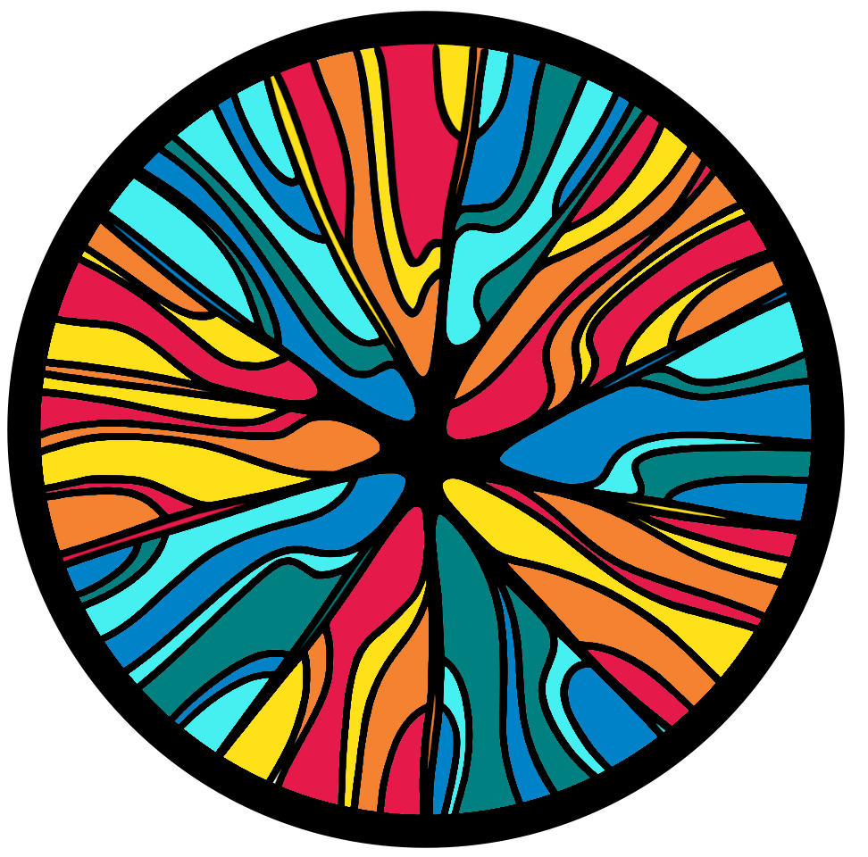{style="max-width:100%" fig-align="center"}
:::
:::::

## Durance river dataset

::::: columns
::: {.column width="60%"}
-   Durance river
-   Water eDNA
-   Upper -> Middle -> Lower
-   Low -> Medium -> High anthropisation
-   Media tested (CVP, KBC, TSA) & environmental (ENV)
-   Pédron et al, 2020
:::

::: {.column width="40%"}
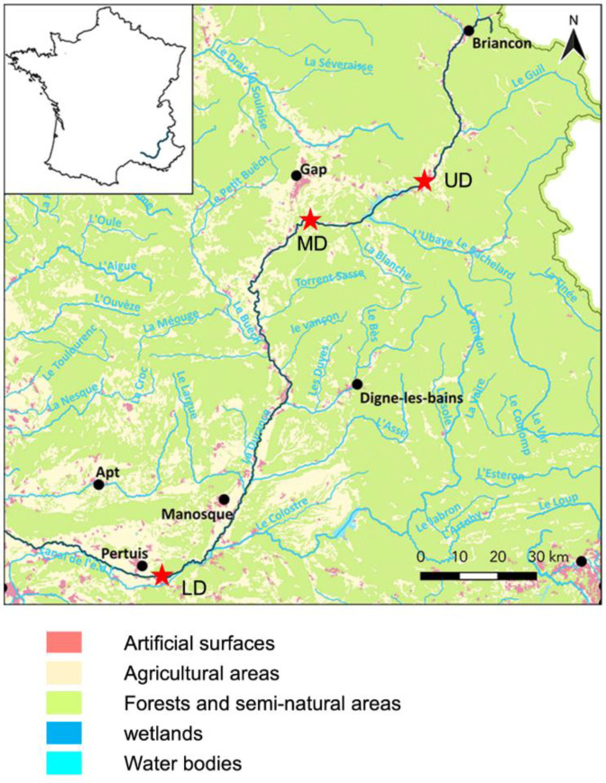{style="max-width:100%" fig-align="center"}
:::
:::::

## Rarefaction

::::: columns
::: {.column width="60%"}
-   Two main applications
-   Sample depth evaluation
    -   Rarefaction curves
-   Normalisation of sample depth evaluation
    -   Subsample counts of all samples to an equal depth
:::

::: {.column width="40%"}
{style="max-width:100%" fig-align="center"}
:::
:::::

## Rarefaction curve

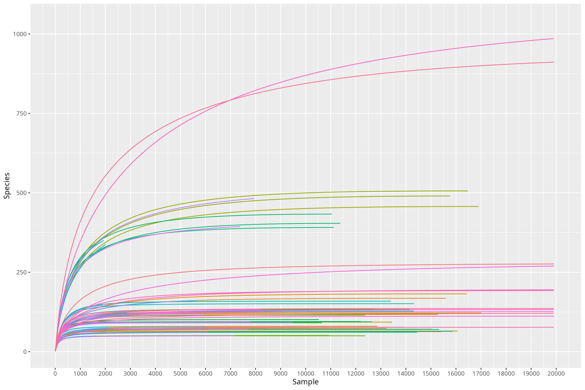{style="max-width:100%" fig-align="center"}

## Rare slope boxplot

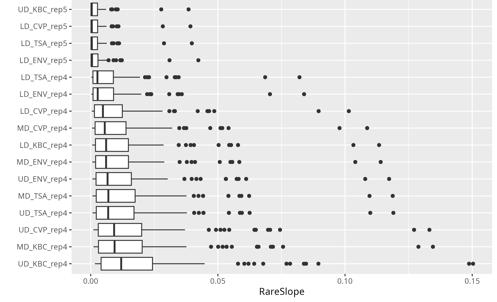{style="max-width:100%" fig-align="center"}

## Rarefaction

::::: columns
::: {.column width="60%"}
-   I recommend carrying out rarefaction normalisation
-   Only for alpha & beta diversity
-   Should bootstrap
    -   I.e. rarefy 1,000 times and get average values
-   I recommend subsampling without replacement
-   Papers for rarefaction
    -   Hong et al, 2022
    -   Schloss 2024
:::

::: {.column width="40%"}
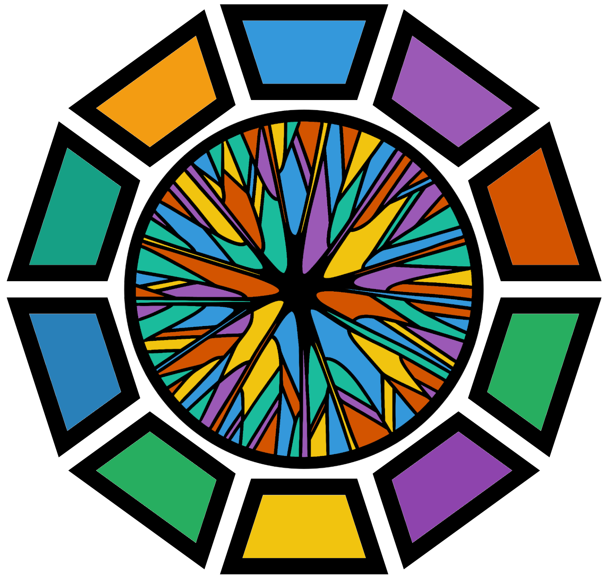{style="max-width:100%" fig-align="center"}
:::
:::::

## Alpha violin plots

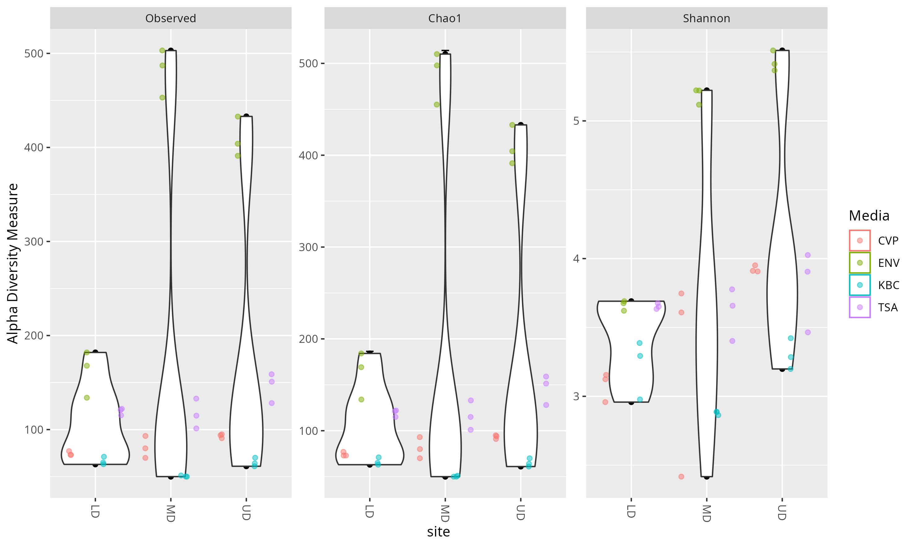{style="max-width:100%" fig-align="center"}

## Beta diversity ordination

Weighted unifrac PCoA

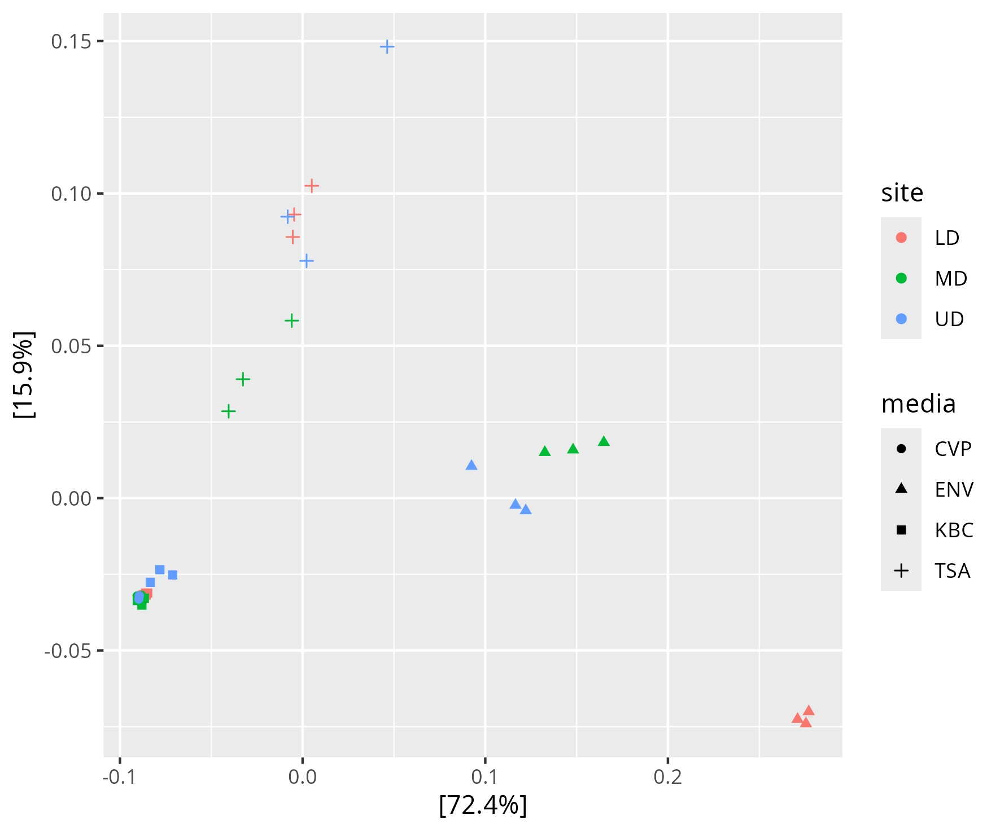{style="max-width:100%" fig-align="center"}

## Beta diversity ordination with zoom

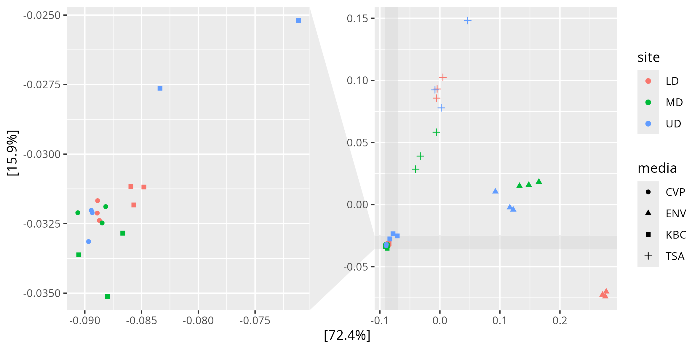{style="max-width:100%" fig-align="center"}

## Divergence analysis

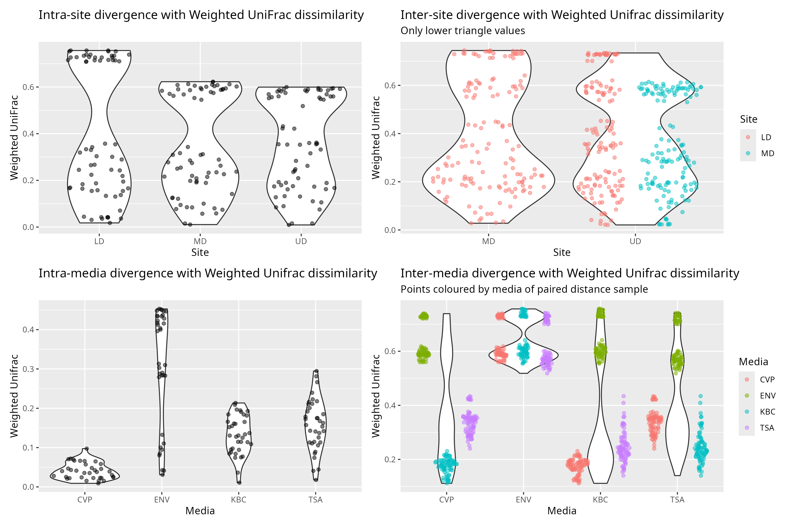{style="max-width:100%" fig-align="center"}

## Intra-media

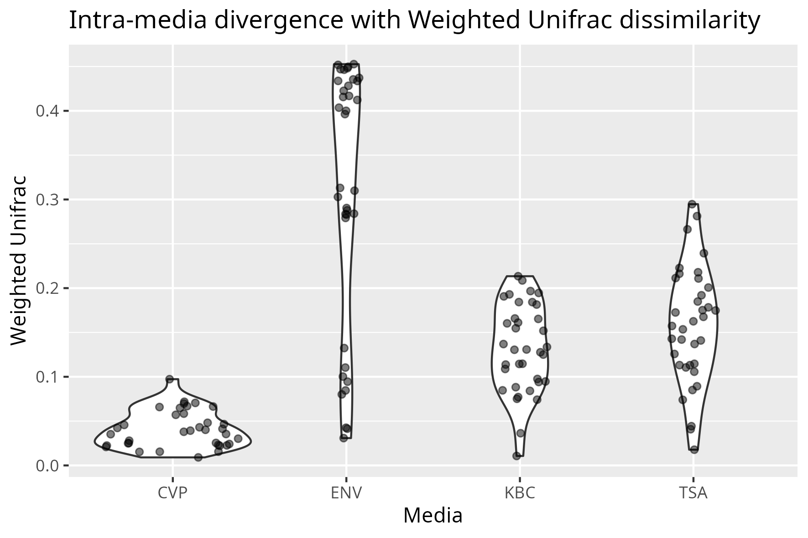{style="max-width:100%" fig-align="center"}

## Inter-media

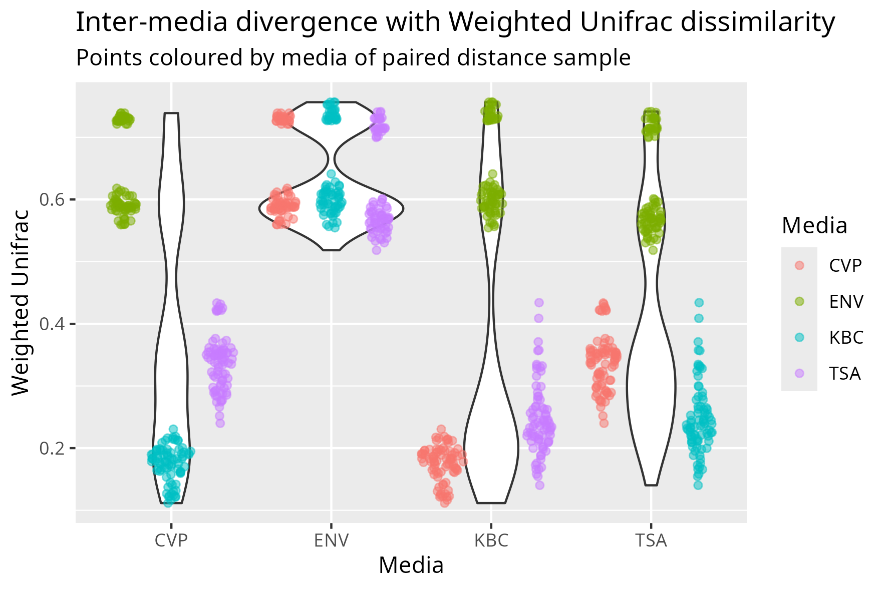{style="max-width:100%" fig-align="center"}

## Upset plots

::::: columns
::: {.column width="50%"}
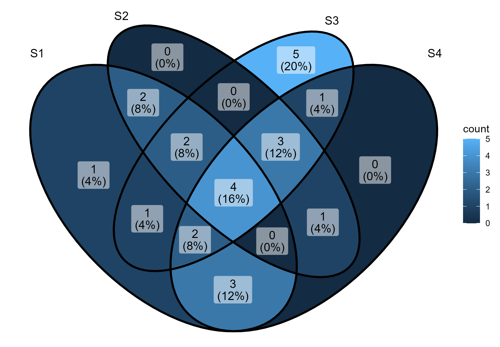{style="max-width:100%; background: white; border-radius:5px" fig-align="center"}
:::

::: {.column width="50%"}
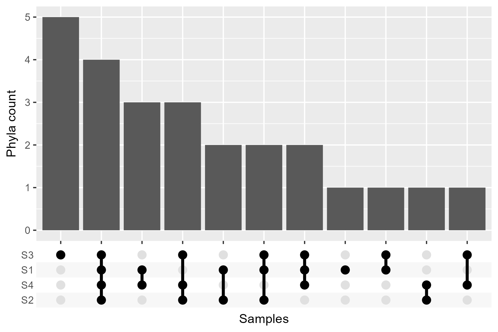{style="max-width:100%; border-radius:5px" fig-align="center"}
:::
:::::

## Site upset plot

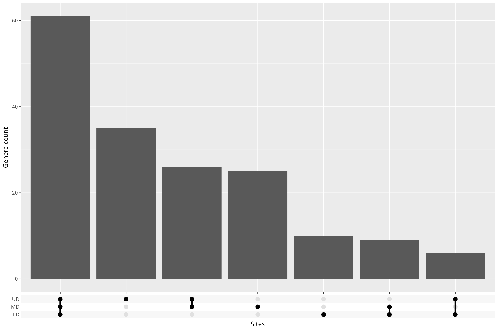{style="max-width:100%; border-radius:5px" fig-align="center"}

## Phyla upset plot

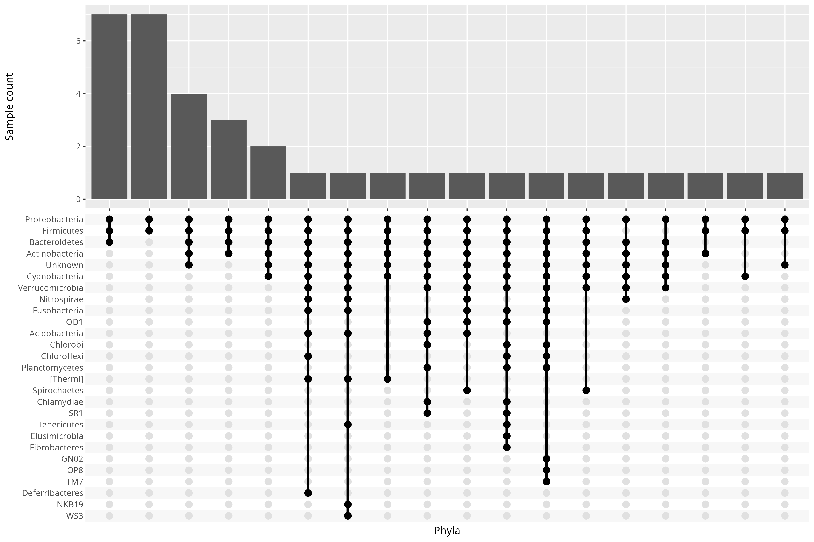{style="max-width:100%; border-radius:5px" fig-align="center"}

## Extra info {.scrollable}

-   My site: [m-gemmell.github.io](https://m-gemmell.github.io/)
-   This presentation: [m-gemmell.github.io/slides/diversity_plots_2026](m-gemmell.github.io/slides/diversity_plots_2026)
-   CGR: [liverpool.ac.uk/genomic-research/](https://www.liverpool.ac.uk/genomic-research/)
-   NEOF workshops: [neof.org.uk/training](https://neof.org.uk/training/)
    - Free and online (UK only)
    - Open: Intro to linux (reg by 21st sep 2026), seq QC, R primer for omics, Python for bioinformatics, Bacterial 16S metabarcoding
    - Open soon: Metabarcoding for diet & eDNA, Shotgun metagenomics, R community analysis, Population genomics, RNAseq

## La fin

Thanks!

Any questions? (if time allows)

{style="max-width:100%; border-radius:5px" fig-align="center"}

## Citations {.scrollable}

1. Hong, Johnny, et al. "To rarefy or not to rarefy: robustness and efficiency trade-offs of rarefying microbiome data." Bioinformatics 38.9 (2022): 2389-2396.
2. Pédron, Jacques, et al. "Comparison of environmental and culture-derived bacterial communities through 16S metabarcoding: a powerful tool to assess media selectivity and detect rare taxa." Microorganisms 8.8 (2020): 1129.
3. Schloss, Patrick D. "Rarefaction is currently the best approach to control for uneven sequencing effort in amplicon sequence analyses." Msphere 9.2 (2024): e00354-23.
