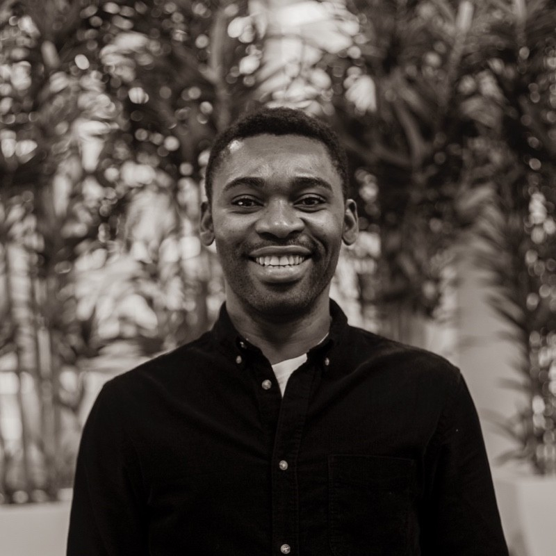
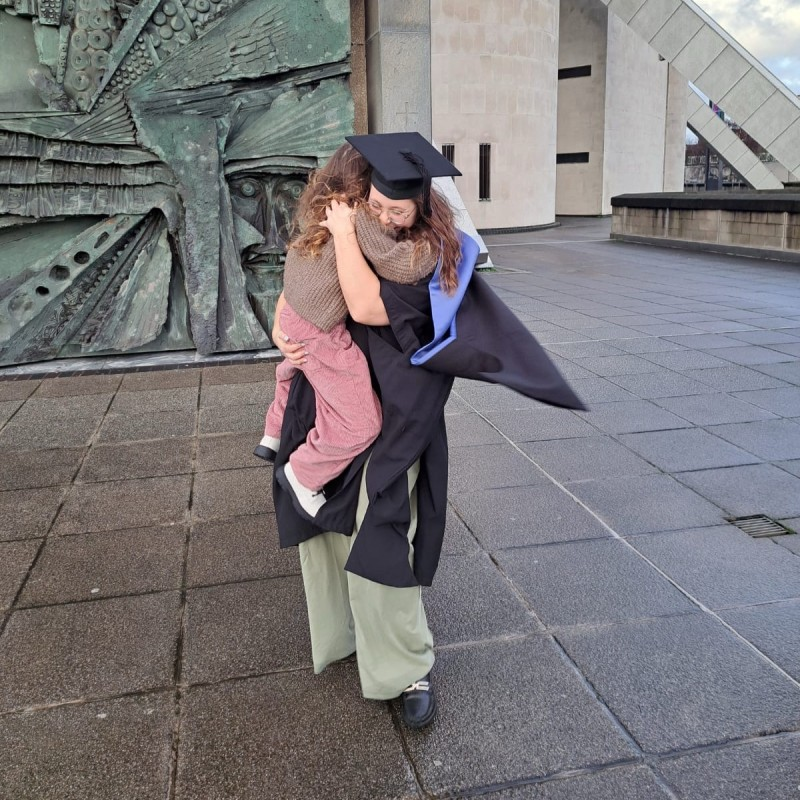
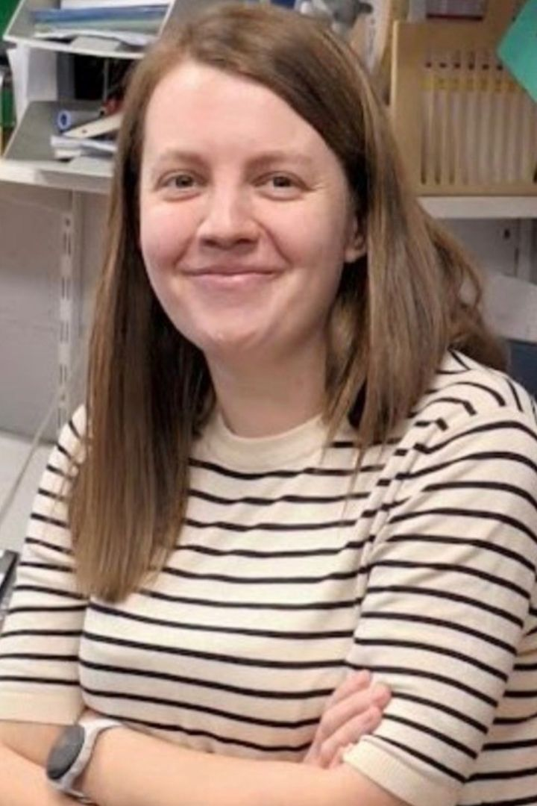

##  {background-color="black" background-image="./images/brick_bg.jpg"}
  
  
  
  
  
  
[Northern BUG17]{.title-slide-text}

## Welcome

::::: columns
::: {.column width="60%"}
-   Thanks for joining us
-   Special thanks to panellists and upcoming presenters
-   Extra special thanks to our sponsors!
-   Merseyside buckets to the coordination teams
:::

::: {.column width="40%"}
{style="max-width:100%" fig-align="center"}
:::
:::::

## Who are we?

-   NorthernBUG: A network of bioinformaticians and users or bioinformatics services in the north of England
-   Hosts: Eva Caamano Gutierrez, Matthew Gemmell, Emily Johnson, & Jamie Soul
-   [CBF](https://www.liverpool.ac.uk/computational-biology-facility/): scientific partners and as service providers offering tailor-made solutions across a wide range of bioinformatics, statistics and functional interpretation of data
-   [CGR](https://www.liverpool.ac.uk/genomic-research/): Core research facility at the University of Liverpool, providing multi-platform sequencing, library preparation, and data analysis

## Presentations

-   BioFAIR with an update (13:05-13:30)
-   Chinedu Anene with Enhancer RNAs beyond transcription (13:30-13:50)
-   Vic aldcroft with talk on climate projections and genomics to future-proof fisheries management (13:50-14:10)
-   Rebecca Price with modelling amyloid fibril polymorphs with AlphaFold3 (14:10-14:30)
-   Poster flash talks (1 min each)

## Strict time keeping

::::: columns
::: {.column width="60%"}
-   Time slot includes 5 minutes for questions at end
-   I'll hold up cards 5, 2, and 1 minute before your question time
-   I'll stand up when you're in your question time
-   I'll cut you off when you're at end of your question time if you're still presenting
:::

::: {.column width="40%"}
{style="max-width:100%" fig-align="center"}
:::
:::::

## Prizes

::::: columns
::: {.column width="40%"}
-   ECRs only
-   Public vote
-   Poster: £40
    - Vic Aldcroft
    - Rebecca Price
    - Lucy Barnard
    - Ellen Boswell
:::
::: {.column width="60%"}
{style="max-width:100%" fig-align="center"}
:::
:::::

## BioFAIR

::::: columns
::: {.column width="50%"}
-   Update on BioFAIR (13:05-13:30)
-   UKRI funded federated digital research infrastructure (£34million over 5 years)
-   Aim to improve "FAIR" research data management
-   Support
-   Training
:::

::: {.column width="50%"}
 
{style="max-width:100%" fig-align="center"}
:::
:::::

## Dr. Chinedu Anene

::::: columns
::: {.column width="60%"}
-   Enhancer RNAs beyond transcription: defining their molecular nature and regulatory functions (13:30-13:50)
-   Senior Lecturer in Bioinformatics
-   Leeds Beckett University
-   RNA biology, cancer genomics, and data-driven approaches to human disease
:::

::: {.column width="40%"}
{style="max-width:100%; border-radius:15px" fig-align="center"}
:::
:::::

## Vic Aldcroft

::::: columns
::: {.column width="60%"}
-   Adapting to change: integrating climate projections and genomic tools to future-proof fisheries management (13:50-14:10)
-   PhD Researcher in Computational Biology
-   University of liverpool
-   Zoology, bioinformatics, and climate science for fisheries management & policies
-   Prize eligible
:::

::: {.column width="40%"}
{style="max-width:100%; border-radius:15px" fig-align="center"}
:::
:::::

## Dr. Rebecca Price

::::: columns
::: {.column width="60%"}
-   Modelling amyloid fibril polymorphs with AlphaFold3 (14:10-14:30)
-   BBSRC GIBA Research Fellow
-   University of Liverpool
-   Gut bacteria produced proteins contribution to neurodegenerative diseases
-   Prize eligible
:::

::: {.column width="40%"}
{style="max-width:50%; border-radius:15px" fig-align="center"}
:::
:::::

## Poster flash talks

- Eva Caamaño Gutiérrez
- Katie Jones (Prize eligible)
- Alex Stafford-Dodsworth (Prize eligible)
- Thouhidur Rahman Chowdhury (Prize eligible)
- Elton Vasconcelos

##  {background-color="black" background-image="./images/Biomedasa_NBUG17_FlashTalk.png"}

## Break & poster time

::::: columns
::: {.column width="40%"}
- Seminar room 2 on the second floor
    - 14:25-15:00
- Be back punctually
- Please talk to our poster presenters
- Last session back here (Lecture theatre 2)
    - 15:00-17:00
:::
::: {.column width="60%"}
{style="max-width:100%" fig-align="center"}
:::
:::::